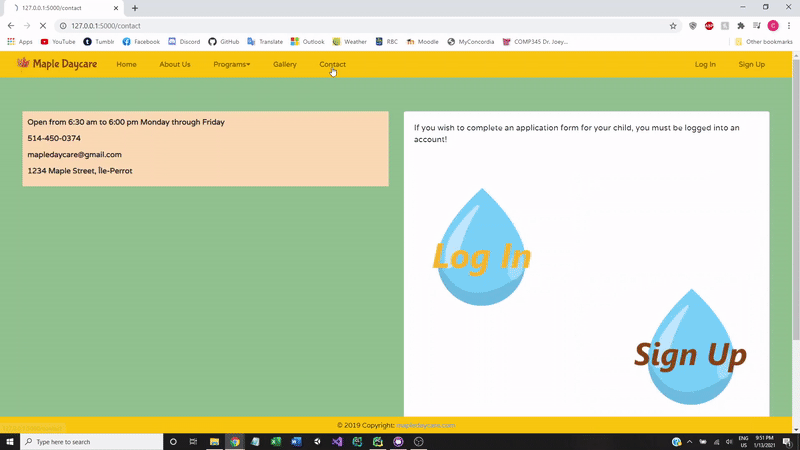
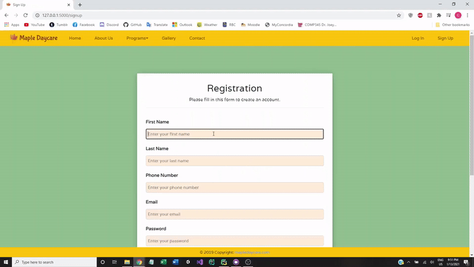
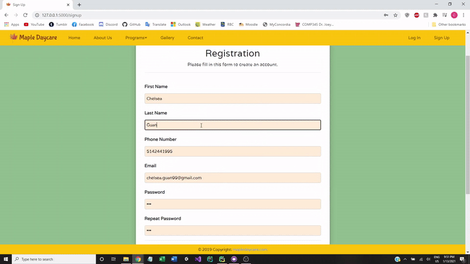
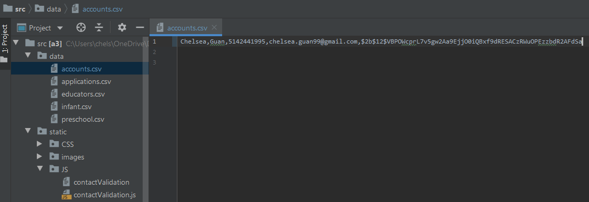
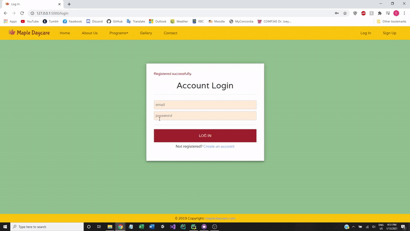
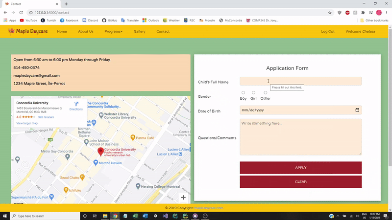

# Daycare-Website
Responsive website with template inheritance, error handling and form validation, built using Python (Flask), JavaScript, CSS (Bootstrap) and HTML. Presence of a CSV file to store customer data and allow for user registration, login and logout.

### Demo Part 1: Home page and About Us page  
  
  
### Demo Part 2: Programs page  
  
  
### Demo Part 3: Gallery page  
  
  
### Demo Part 4: To contact the daycare owner, the user must first login to their account  
  
  
### Demo Part 5: Registration  
  
Since this user is new, they must fill in the registration page. However, they forgot to fill in the "Last name" textbox, which is mandatory. Validation is unsuccessful.  
  
  
The user enters a last name, but their password is too short. Upon entering a longer password, the form is validated and an account is created for the user.  
  
  
The user's information is stored in a CSV file called "accounts.csv", where a salt is added to the password and the result is hashed.  
  
  
### Demo Part 8: Successful user login  
  
  
### Demo Part 9: Contact  
  
The form can be cleared to its original state.  
  
  
Upon successfully contacting the daycare owner, a confirmation message is displayed.  
  
